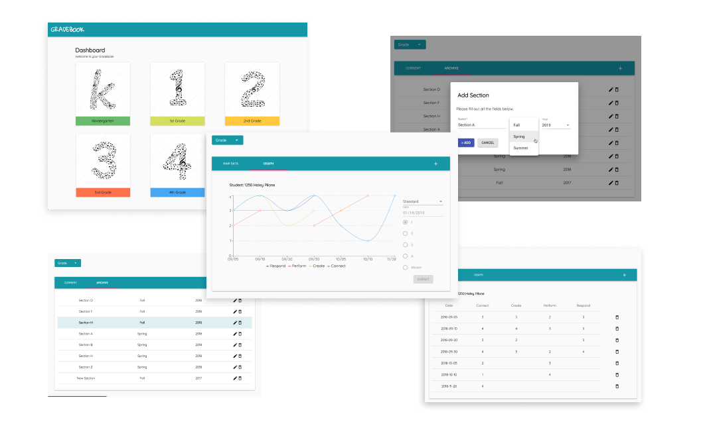

# ONLINE GRADEBOOK

This Senior Project was created for an elementary school music teacher. The interactive GradeBook is a web-based application design to keep track and record student’s grades over an unlimited period of time. The application is intended to be a user-friendly application, very similar to spreadsheets in which the instructor can keep his student’s scores in an effective and orderly way. Additionally, the application allows the instructor to visually see the progress over time of each student by using a linear graph to illustrate a student’s grades over the period of a semester.

## Getting Started

2.  Clone this repo using `git clone --depth=1 https://github.com/ajraymond94/gradebook.git <YOUR_PROJECT_NAME>`
3.  Move to the appropriate directory: `cd <YOUR_PROJECT_NAME>`. 
4.  Run `npm run setup` in order to install dependencies and clean the git repo. 
5.  Change the database setting from [server/index.js](server/index.js).
6.  Run `npm start` to see the example app at `http://localhost:3000`.

### Prerequisites
1. Make sure that you have Node.js v8.10 and npm v5 or above installed.
2. You must have a database set up in a server that uses phpmyadmin and have access to tthe database.

Now you're ready to use the GRADEBOOK!

> Please note that this boilerplate is **production-ready and not meant for beginners**! If you're just starting out with react or redux, please refer to https://github.com/petehunt/react-howto instead. If you want a solid, battle-tested base to build your next product upon and have some experience with react, this is the perfect start for you.

## User Manual
To see a quick overview with image of the application go to [User Manual](user-manual.md)

## Authors
*  Angela Raymond
*  [react-boilerplate](https://www.reactboilerplate.com/) - environment

## Build With

* [react-boilerplate](https://www.reactboilerplate.com/) - used to set up the
environment of the application.
* [MAMPP] - Used for mysql database
* [Material-ui](https://material-ui.com/)

## License

This project is licensed under the MIT license, Copyright (c) 2018 Maximilian
Stoiber. For more information see `[LICENSE.md](LICENSE.md)`.
