### Abstract

This Senior Project was created specifically for Jeffrey Thomas an
elementary school music teacher in the Hagerstown area. The interactive
GradeBook is a web-based application design to keep track and record
student's grades over an unlimited period of time. The application is
intended to be a user-friendly application, very similar to spreadsheets
in which the instructor can keep his student's scores in an effective
and orderly way. Additionally, the application allows the instructor to
visually see the progress over time of each student by using a linear
graph to illustrate a student's grades over the period of a semester.

### Problem Description
The Interactive Gradebook idea came from asking a current faculty
teacher in an elementary school what he would whish he could create in
order to make his job more efficient. After having a few conversation a
problem kept been brought up. Currently Mr. Thomas does not have an
efficient and reliable way to keep track of his grading. He has used
many different grade books throughout his teaching carrier and according
to him he has not found one he truly likes. The interactive GradeBook is
design to satisfy his needs and wants.

As an elementary school teacher, Mr. Thomas teaches grades Kindergarten
to 5^th^ grade, and each grade level has around 6 sections. Each section
has approximately 20-30 students and each student must be within each
respective section. Additionally, each student is scored based on four
different standard: perform, create, respond, and connect. Each standard
has a scoring between 1- 4 or absent if the student is absent during
that class period.

In order to satisfy his needs and want the interactive GradeBook must
have three main features:

1.  The application must be accessible anywhere, therefore the
    application is an online web-app which allows the user to access
    it anywhere. They application can also be access locally using a
    browser.

2.  The application must have a user-friendly interface. This means a
    simple, efficient, eye appealing application. Furthermore, the
    application must have a very similar interface as an excel
    spreadsheets.

3.  A reliable database is essential since it hold all the information
    and data. In order for the GradeBook to be efficient and useful
    the database must keep an accurate record of all the data. The
    sections within each grade level, the student participating in
    each section and all the score based on each student.

### User Manual

1.  Currently, since the application is not live in order for the user
    to access the application, he must use the terminal and type npm
    start in the directory in which the React application is saved.

    Once the server starts successfully, the terminal will show the
    following message:
    
    

2.  Now the user can type in a web browser <http://localhost:3000/>.
    This will show the application.

3.  **Home Component**: Once the user browses to
    <http://localhost:3000/>, the home page will be displayed. The home
    page holds the main dashboard of the application. The Dashboard
    contains all the grade level from K- 5^th^ grade. Every grade level
    is clickable, so when the user clicks on grade 1^st^, then it will
    change the view to Section Component.

    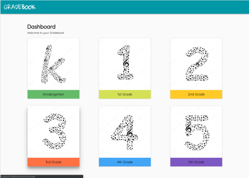

4.  **Section Component**: If the user clicks on a grade level
    component, then the application will render the Section Component.
    This component is in charge of displaying all the sections within
    the grade level that was chosen. Each section row is clickable. The
    Section Component allows the user to do six different things:

    a.  The Section Component retrieves data from the database and
        displays all the sections within a grade-level in a list-like
        container. Each section has a term (Fall, Summer, Spring), and
        the year the section was created.
        
       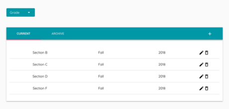
        
    b.  **Current/Archive**: The user can pick between a Current and
        Archive sections. If the user wants to see the current list of
        section then the tab current must be clicked, but if the user
        wants to see the archive sections then the archive section must
        be clicked.
        
       The application is coding in a way in which based on the current
       date it will sort the sections based on the year, and term.

       Definition of Terms are as follow:

       If 17 September 2018 to 14 December 2018 - \> Fall.

       If 7 January 2019 to 5 April 2019 -\> Spring.

       If 15 April 2019 to 31 May 2019 -\> Summer
       
       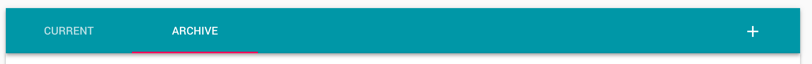
        

    c.  **Add**: If a user wants to add a section, then the icon plus
         must be clicked. A dialog will open,
        and the user must fill the information needed in order to add a new
        section.

       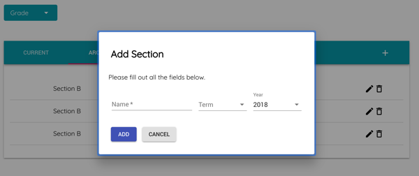

    d.  **Edit**: Next to each section there is a pencil icon
         , this allows the user to edit the
        section. Once the pencil is clicked then a dialog opens so the user
        can edit the name, term, or year of the selected section.

       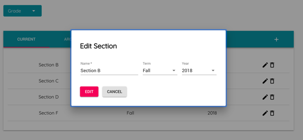
    
    e.  **Delete**: If a user desires to delete a section, he only need to
        click on the trash icon
         next to the pencil to delete the
        section. Before the section is delete, the application will prompt
        the user to verify the deletion of the section. Once a section is
        deleted, all the information within that section will be lost.

       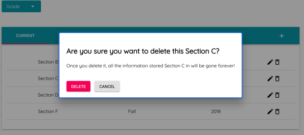

    f.  **Change Grade-level**: If the user desired to select a different
        grade-level, then the drop-down menu can be used to change it.

       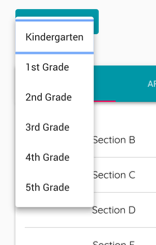

5.  **Student Component**: If the user clicks on a section, then the
    application will render the Student Component. This component is in
    charge of displaying the list of students who are in the chosen
    sections. Each student row is clickable. The Student Component
    allows the user to do five different things:

    a.  The Student Component retrieves data from the database and
        displays the lists of students within the section. Each student
        has a first name, last name, and id.

       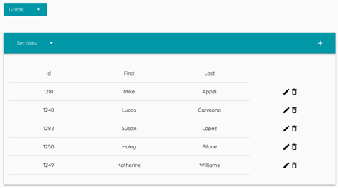

    b.  **Add**: If a user wants to add a new student to the section,
        then the icon plus
         must be clicked. A dialog will
        open, and the user must fill the information needed in order to
        add a new student.

       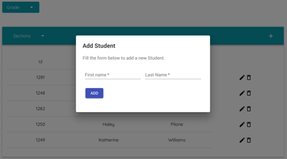

    c.  **Edit**: Next to each student there is a pencil icon
        , this allows the user to edit
        the student. Once the pencil is clicked a dialog opens allowing
        the user to edit the first name, or last name.

       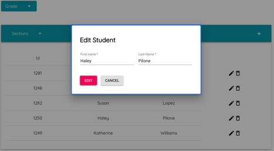

    d.  **Delete**: To delete a student the trash icon
         next to the pencil icon must be
        clicked. Before the student is delete, the application will prompt
        the user to verify the deletion of the student. Once a student is
        deleted, all the information within that student will be lost.

       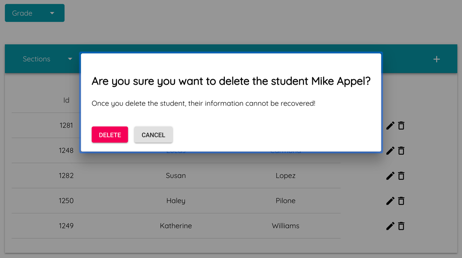

    e.  **Change Grade-level**: If the user desired to select a different
        grade-level, then the drop-down menu can be used to change it.

       

5.  **Student Data Component**: After a student is selected the
    application will render the Student Data Component. This component
    allows the user to see a linear graph (visualization of student's
    scores over time-), and the raw data (a table with the scores).

    The Student Data Component allows the user to multiple things:

    a.  **Raw Data/Graphed Data**: The user can pick between a viewing
        the raw data or the linear graph. If the user wants to see the
        raw data, then the tab Raw Data must be clicked; but if the user
        wants to see the graph sections then the Graph tab must be
        clicked.

       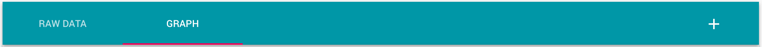

    b.  **Raw Data**: If the user clicks Raw Data then the application
        will render a table with all the student's scores. It is
        organized based on the date the scores were added.

       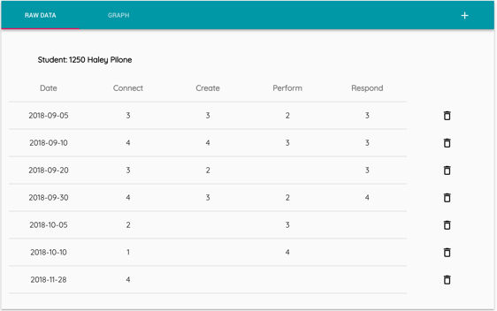

    c.  **Raw Data-Delete**: The trash icon
         can be used to delete scores of
        based on a date. The user must click on the icon and before the
        date is delete, the application will prompt the user to verify
        the deletion of the date. Once the date is deleted, then all the
        scores within that date will be also deleted.

       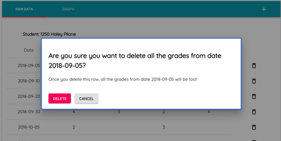

    d.  **Raw Data-Add/Edit**: To edit or add a score the user must
        click on the plus icon
        . Once its clicked, then a dialog
        will open so the user can add or edit a score based on the date
        as well as standard.

       i.  To pick a standard the standard drop-down menu must be click
           and the user must pick between the four standards.

       

    g.  **Graph-Add/Edit**: Next to the graph there is a container that
        allows the user to edit or add a score. In order to add a new
        score to the database and the graph. The user must select a new
        standard by clicking on the drop-down menu. After clicking the
        standard, the user must pick a date, and ultimately the user
        must select the score between 1, 2, 3, 4, or Absent. Once the
        scored is selected and the user clicks submit. The score will be
        added to the grade book and a new line will be displayed on the
        graph.

       iv. To pick a standard the standard drop-down menu must be click
           and the user must pick between the four standards.

       
       
       v.  To pick a date the date input must be selected. The user can
           pick any date. The application uses the current date as
           default.

       

       vi. Finally, a user must pick a score. There are four score from
           1-4 and Absent. If the user picks Absent, then the student
           will get no grade for that date.

       

6.  **Back to Home**: To go back to the home page just clicked on the
    logo located in the header. 
